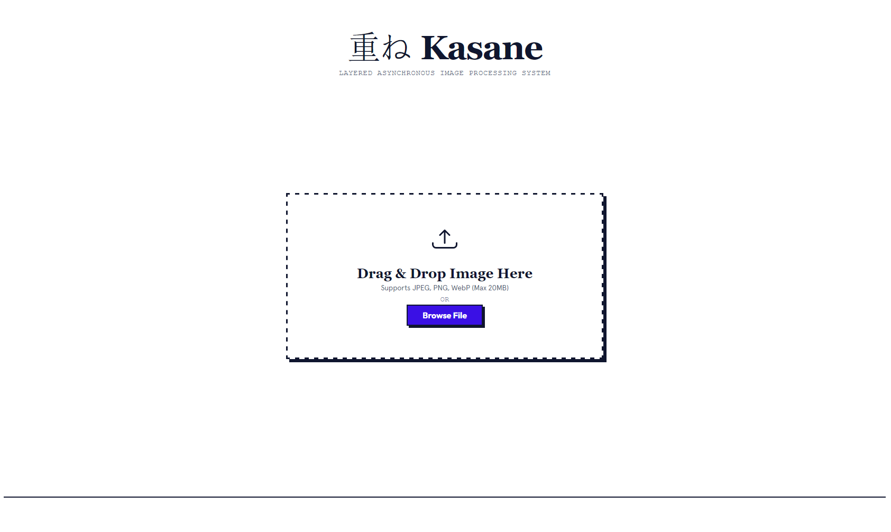
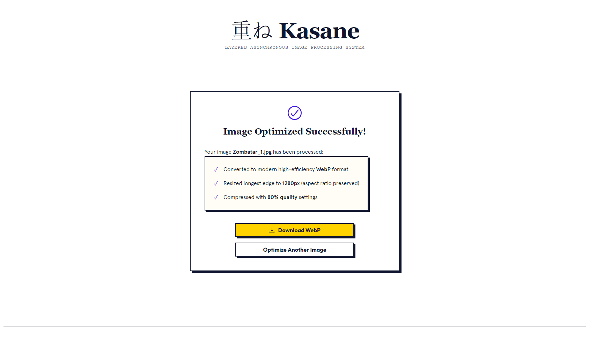
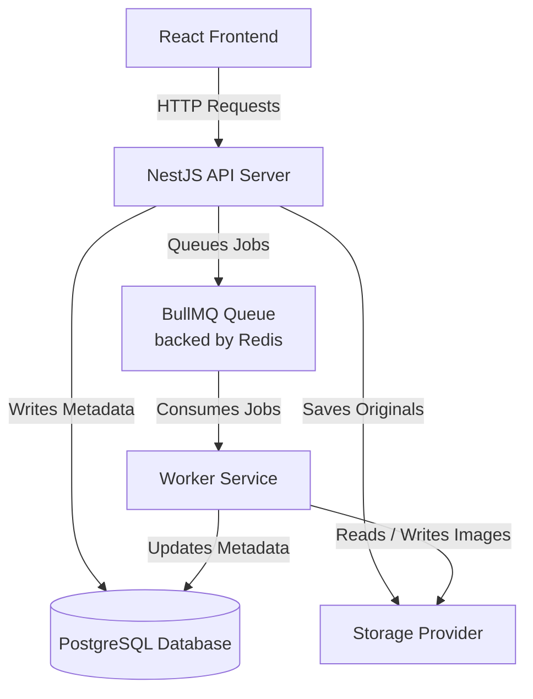

# Project Kasane (重ね)

**Kasane (重ね)** means _to layer_. This project implements a layered, asynchronous image processing web application where each component has a single responsibility.





---

## 1. Docker Compose Tutorial

If you have Docker Desktop installed, you can spin up the entire monorepo stack (PostgreSQL, Redis, NestJS Backend, Background Worker, and React Frontend) with a single command from the project root:

```bash
# Build and start all services
docker compose up --build
```

### Accessing the Application
Once the containers are running, you can access the services directly at these URLs:
* **Frontend UI:** [http://localhost:5173](http://localhost:5173) (Served by Nginx)
* **Backend API:** [http://localhost:3001](http://localhost:3001)

### Stopping the Stack
To stop the containers and completely wipe out all temporary database data and uploaded files:
```bash
docker compose down -v
```

---

## 2. Local Deployment Tutorial

Follow these steps to deploy and run Project Kasane locally on your machine.

### Step 1: Start PostgreSQL and Create Database

Since PostgreSQL is installed via scoop on Windows, run the following commands in your terminal:

```powershell
# Start PostgreSQL server
pg_ctl start

# Create the application database
createdb -U postgres kasane
```

### Step 2: Start Redis on WSL

Since Redis is run via Windows Subsystem for Linux (WSL), open your WSL terminal (e.g., Ubuntu) and start the Redis service:

```bash
# Start Redis server
sudo service redis-server start

# Verify Redis is running and listening on default port 6379
redis-cli ping
# Should respond with "PONG"
```

### Step 3: Set Up Environment Configuration

From the project root on Windows, copy `.env.example` to `.env`:

```powershell
copy .env.example .env
```

The application is configured using this shared `.env` file. Below is the list of environment variables used:

| Variable                    | Description                                              | Default         |
| :-------------------------- | :------------------------------------------------------- | :-------------- |
| `PORT`                      | The port the NestJS API backend server will run on       | `3001`          |
| `REDIS_HOST`                | Host address for the Redis server (used by BullMQ)       | `127.0.0.1`     |
| `REDIS_PORT`                | Port number for the Redis server                         | `6379`          |
| `REDIS_PASSWORD`            | Optional password for Redis connection                   | _None_          |
| `DB_HOST`                   | Host address for the PostgreSQL database server          | `127.0.0.1`     |
| `DB_PORT`                   | Port number for the PostgreSQL database server           | `5432`          |
| `DB_USERNAME`               | Username for the PostgreSQL server                       | `postgres`      |
| `DB_PASSWORD`               | Password for the PostgreSQL server                       | _None_          |
| `DB_NAME`                   | Database name for PostgreSQL                             | `kasane`        |
| `STORAGE_PROVIDER`          | Storage backend driver. Supported: `local` or `supabase` | `local`         |
| `LOCAL_STORAGE_DIR`         | Directory on disk to store images (when using `local`)   | `./uploads`     |
| `SUPABASE_URL`              | Your Supabase project URL (when using `supabase`)        | _None_          |
| `SUPABASE_SERVICE_ROLE_KEY` | Supabase service role key (when using `supabase`)        | _None_          |
| `SUPABASE_BUCKET`           | The Supabase Storage bucket name                         | `kasane-images` |

_(By default, this is configured for PostgreSQL running at `127.0.0.1:5432` and **Local Storage** fallback, meaning it will run immediately once the local services are running.)_

### Step 4: Run the NestJS Backend

Open a terminal in the `backend/` directory:

```bash
cd backend
npm install
npm run dev
```

The backend server will start at [http://localhost:3001](http://localhost:3001) and will automatically initialize the database schema in PostgreSQL.

### Step 5: Run the Image Processing Worker

Open a new terminal in the `worker/` directory:

```bash
cd worker
npm install
npm run dev
```

The worker will connect to Redis and PostgreSQL, ready to consume and process incoming image jobs.

### Step 6: Run the React Frontend

Open a new terminal in the `frontend/` directory:

```bash
cd frontend
npm install --legacy-peer-deps
npm run dev
```

The Vite development server will spin up. Open your browser and navigate to the printed URL (typically [http://localhost:5173](http://localhost:5173)) to start resizing images!

---

### Step 7: Running the Tests

To verify that the application modules are functioning correctly, you can run the automated test suite. All tests run in-memory, completely isolated from your live PostgreSQL and Redis services.

#### 1. How to Run

You can run all tests sequentially with a single command from the project root:
```bash
# 1. Install all dependencies across all layers (backend, worker, frontend)
npm run install:all

# 2. Run all test suites (backend & worker)
npm run test
```

Alternatively, you can run tests for specific layers from the root folder:
* **Backend API Server tests:** `npm run test --prefix backend`
* **Worker Service tests:** `npm run test --prefix worker`

#### 2. Test Suite Details

##### Backend Layer (NestJS API)
* **App Controller Unit Tests** ([backend/test/app.controller.test.ts](backend/test/app.controller.test.ts)):
  * Verifies the root endpoint returns the default NestJS greeting ("Hello World!").
* **Upload Controller Unit Tests** ([backend/test/upload.controller.test.ts](backend/test/upload.controller.test.ts)):
  * Verifies correct metadata returns (like `jobId`) for valid image uploads.
  * Ensures a `BadRequestException` is thrown when a file is missing.
  * Ensures uploads larger than 20MB are blocked.
  * Ensures non-image files (e.g. `text/plain`) are blocked.
* **Upload Service Unit Tests** ([backend/test/upload.service.test.ts](backend/test/upload.service.test.ts)):
  * Confirms the upload service stores files correctly, initializes database entries as `pending`, and pushes jobs to the Redis/BullMQ queue.
  * Verifies gracefully throwing exceptions if the storage layer fails mid-upload.
* **Jobs Service Integration Tests** ([backend/test/jobs.service.test.ts](backend/test/jobs.service.test.ts)):
  * Tests datastore persistence logic by mocking the TypeORM Repository to ensure mock entries can be retrieved and created in isolation without hitting your active PostgreSQL database.

##### Worker Layer (Image Processor)
* **Image Processor Unit Tests** ([worker/test/image.processor.test.ts](worker/test/image.processor.test.ts)):
  * **Portrait Scaling:** Verifies that a $1000 \times 2000$ image scales down proportionally to exactly $640 \times 1280$ (longest edge capped to 1280px).
  * **Landscape Scaling:** Verifies that a $2000 \times 1000$ image scales down proportionally to exactly $1280 \times 640$.
  * **Square Scaling:** Verifies that a small $500 \times 500$ image scales up cleanly to $1280 \times 1280$.
  * **WebP Conversion:** Asserts output formats are correctly transformed to `webp`.
  * **Error Handling:** Asserts bad or corrupt binary buffers are rejected with a thrown exception.

---

## 3. Architecture Choice

### 3.1 Architectural Decisions & System Flow

The system is designed with a **layered, asynchronous worker architecture** to reflect standard production patterns for CPU-intensive tasks. Below is the flow of the application and the rationale behind each key architectural decision:

#### 1. Decoupled Worker Architecture (BullMQ & Redis)
* **How it works:** When a user uploads an image, the NestJS API server uploads the original file to storage, creates a database record, enqueues a processing task in **BullMQ (backed by Redis)**, and immediately returns the `jobId` to the frontend without waiting for processing.
* **Why this choice:** Image manipulation is a CPU-bound operation. By immediately returning a response and offloading the processing to BullMQ, we prevent blocking the NestJS event loop. This ensures the API server remains fast, responsive, and capable of handling high volumes of concurrent requests.

#### 2. Separation of Services (API vs. Worker)
* **How it works:** The NestJS API server and the Image Processing Worker run as separate, independent processes.
* **Why this choice:** In production, HTTP traffic (I/O-bound) and image resizing (CPU-bound) have very different resource demands. Separating them allows them to scale independently. During heavy load, we can run multiple instances of the worker service without needing to scale the API servers.

#### 3. Image Processing Engine (Sharp)
* **How it works:** The background worker uses the **Sharp** library to resize the image (longest side to 1280px, maintaining aspect ratio), compress it to 80% quality, and convert it to WebP format.
* **Why this choice:** Sharp is powered by the `libvips` C library. It is typically 4x to 5x faster than pure JavaScript alternatives (like Jimp) and consumes a fraction of the memory, which is critical for handling large images up to 20MB.

#### 4. Abstracted Storage Layer (Local vs. Cloud)
* **How it works:** Both the API and Worker interface with a generic `StorageService` class. The storage provider can be toggled in `.env` between `local` disk storage and `supabase` cloud storage.
* **Why this choice:** This clean abstraction enables instant local development fallback (no setup required) while allowing seamless deployment to production cloud storage (like AWS S3 or Supabase Storage) by changing a single environment variable, without touching the core code.

#### 5. Exponential Backoff Polling
* **How it works:** The React frontend polls the job status (`GET /jobs/:id`) starting at 2s intervals. If the job takes longer, it backs off to 4s, 8s, and caps at 16s. Polling stops immediately upon job completion or failure.
* **Why this choice:** Polling is a simple and reliable way to fetch status. Using exponential backoff protects the server from being spammed with requests by active clients during periods of high queue congestion or long-running tasks.

### 3.2 Architecture Diagram

Below is the visual diagram illustrating the system's architecture and component interactions.


