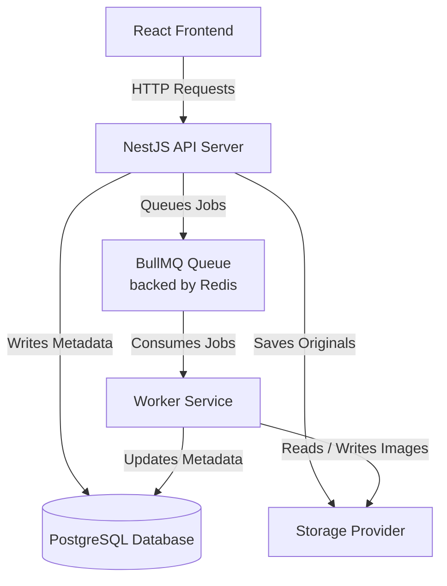

# Project Kasane (重ね)

**Kasane (重ね)** means _to layer_. This project implements a layered, asynchronous image processing web application where each component has a single responsibility.


---

## 1. Environment Configuration

The application is configured using a shared `.env` file at the root of the project. A `.env.example` is provided as a reference.

| Variable                    | Description                                              | Default         |
| :-------------------------- | :------------------------------------------------------- | :-------------- |
| `PORT`                      | The port the NestJS API backend server will run on       | `3001`          |
| `REDIS_HOST`                | Host address for the Redis server (used by BullMQ)       | `127.0.0.1`     |
| `REDIS_PORT`                | Port number for the Redis server                         | `6379`          |
| `REDIS_PASSWORD`            | Optional password for Redis connection                   | _None_          |
| `DB_HOST`                   | Host address for the PostgreSQL database server          | `127.0.0.1`     |
| `DB_PORT`                   | Port number for the PostgreSQL database server           | `5432`          |
| `DB_USERNAME`               | Username for the PostgreSQL server                       | `postgres`      |
| `DB_PASSWORD`               | Password for the PostgreSQL server                       | _None_          |
| `DB_NAME`                   | Database name for PostgreSQL                             | `kasane`        |
| `STORAGE_PROVIDER`          | Storage backend driver. Supported: `local` or `supabase` | `local`         |
| `LOCAL_STORAGE_DIR`         | Directory on disk to store images (when using `local`)   | `./uploads`     |
| `SUPABASE_URL`              | Your Supabase project URL (when using `supabase`)        | _None_          |
| `SUPABASE_SERVICE_ROLE_KEY` | Supabase service role key (when using `supabase`)        | _None_          |
| `SUPABASE_BUCKET`           | The Supabase Storage bucket name                         | `kasane-images` |

---

## 2. Local Deployment Tutorial

Follow these steps to deploy and run Project Kasane locally on your machine.

### Step 1: Start PostgreSQL and Create Database

Since PostgreSQL is installed via scoop on Windows, run the following commands in your terminal:

```powershell
# Start PostgreSQL server
pg_ctl start

# Create the application database
createdb -U postgres kasane
```

### Step 2: Start Redis on WSL

Since Redis is run via Windows Subsystem for Linux (WSL), open your WSL terminal (e.g., Ubuntu) and start the Redis service:

```bash
# Start Redis server
sudo service redis-server start

# Verify Redis is running and listening on default port 6379
redis-cli ping
# Should respond with "PONG"
```

### Step 3: Set Up Environment Configuration

From the project root on Windows, copy `.env.example` to `.env`:

```powershell
copy .env.example .env
```

_(By default, this is configured for PostgreSQL running at `127.0.0.1:5432` and **Local Storage** fallback, meaning it will run immediately once the services are running.)_

### Step 4: Run the NestJS Backend

Open a terminal in the `backend/` directory:

```bash
cd backend
npm install
npm run dev
```

The backend server will start at [http://localhost:3001](http://localhost:3001) and will automatically initialize the database schema in PostgreSQL.

### Step 5: Run the Image Processing Worker

Open a new terminal in the `worker/` directory:

```bash
cd worker
npm install
npm run dev
```

The worker will connect to Redis and PostgreSQL, ready to consume and process incoming image jobs.

### Step 6: Run the React Frontend

Open a new terminal in the `frontend/` directory:

```bash
cd frontend
npm install --legacy-peer-deps
npm run dev
```

The Vite development server will spin up. Open your browser and navigate to the printed URL (typically [http://localhost:5173](http://localhost:5173)) to start resizing images!

---

## 3. Architecture Choice

### 3.1 System Flow & Execution Mechanism

When a user selects or drags an image into the React frontend, the app validates the file format (JPG, PNG, WebP) and size (under 20MB). On validation success, it sends a multipart `POST /upload` request to the NestJS API server. The API server uploads the original image to the configured storage provider (local folder or Supabase bucket) and creates a record in the PostgreSQL database with a status of `pending`. The server then enqueues a background task in the BullMQ queue (backed by Redis) and immediately returns the job ID to the frontend without waiting for the image to be processed.

Once the job is queued in Redis, BullMQ handles task distribution. The separate, dedicated Worker Service listens to this queue; when it becomes idle, BullMQ assigns the next available job to the worker. Upon receipt, the worker immediately updates the job status in the PostgreSQL database to `processing`. The worker then downloads the original image from the storage provider, processes it sequentially using the Sharp engine (resizing the longest side to 1280px maintaining aspect ratio, converting to WebP, and compressing to 80% quality), uploads the optimized image back to the storage provider, and updates the database job status to `completed` (or `failed` with error details if an exception is caught).

Meanwhile, the React frontend polls the status of the job by sending a `GET /jobs/:id` request to the NestJS server. Polling begins immediately at a 2-second interval. It implements an exponential backoff strategy (increasing the polling interval to 4s, 8s, and capping at 16s if the job takes longer) to minimize server load. Once the poll returns a status of `completed`, polling stops, and the frontend reveals a download button pointing to the NestJS server's `GET /jobs/:id/download` stream endpoint.

### 3.2 Architecture Diagram

Below is the visual diagram illustrating the system's architecture and component interactions.


